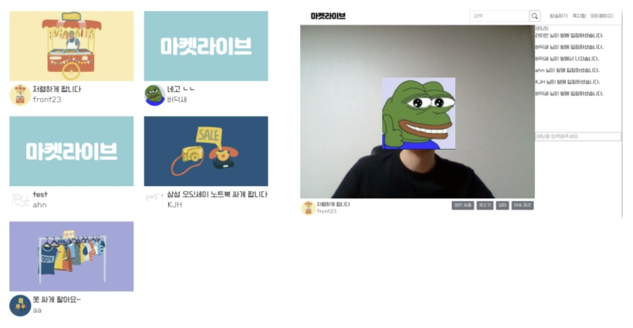
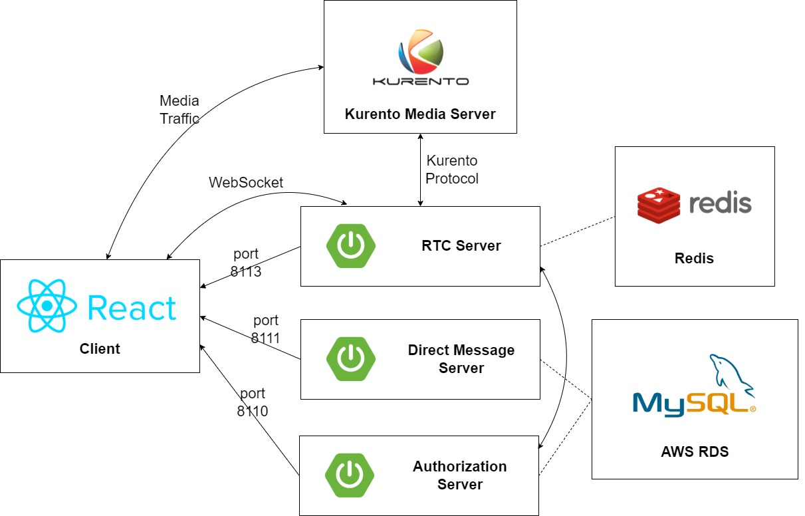

# Market Live

## 프로젝트 개요
- WebRTC를 활용한 화상 중고거래 서비스
- 2022.01.10 ~ 2022.02.18 (약 6주)

## 주요 기능
- (판매자)1 : (구매자)N 의 live-commerce 시스템
- 실시간 채팅
- multi-room 구현
- 쪽지 보내기

## 맡은 역할
- RTC server
  - multi-room 구현
  - 1:N broadcasting system
  - chatting
- DevOps / Infra
  - CI/CD pipeline(jenkins)
  - ssl 인증서
  - docker

## 주요 기술
### 1. FRONTEND 
- React
  - mobile에서도 동작 가능한 반응형 웹 구현

### 2. BACKEND 
- Spring Boot : 전반적인 Rest Controller 구현
- JWT
- JPA (Hibernate)
- WebSocket : media server 통신, chatting 구현
- Redis : room 정보 저장
- MySQL : 이용자 정보 저장
- Kurento : WebRTC 기능적 구현을 제공하는 media server

### 3. BACKEND - DevOps / Infra
- Nginx : reverse proxy 처리
- SSL : Certbot을 사용하여 무료 인증서 발급
  - rtc 사용 시 SSL 필수
- AWS EC2 ubuntu
- Docker : Service 관리 및 배포 용이
- Jenkins : 배포 자동화

### 4. TEAM
- GitLab
- Jira
- Google Drive

## 동작 화면

## Backend Architecture

## 내가 생각한 개선해야 될 점 (많음...)

+ Jenkins Pipeline Script에 docker 명령어를 직접 입력, shell script 실행하는 반복작업
  - Docker-Compose.yml 사용해서 미리 설정 저장 가능
    
+ 시간상 Kubernetes 사용 안함.
  - Microservice가 많아질 경우 관리를 위해 Docker-hub와 같이 운용할 수 있을것
    
+ 인증 서버를 무조건 거쳐야 된다는 점(Microservice 간의 통신 불편함), 서버의 port 노출됨 
  - Spring Cloud Gateway 사용, 자동 인증 넣기
  - nginx처럼 reverse proxy 사용 가능, URI 라우팅 가능해짐(관리 편함)
    
+ nginx를 잘 몰라서 ssl 인증서를 발급받아 microservice마다 직접 넣었었음.
  - frontend가 기본 3000번 포트에서 돌아가 proxy-pass를 해 버렸더니 backend는 직접 포트로 접근해야 되는 문제 발생
  - frontend를 80이나 443으로 바꾸고 websocket 연결할 때 proxy-pass 및 CORS 처리, upgrade 처리하면 될 듯
    
+ 진정한 MSA를 위해 각 server마다 독립적인 redis, RDS 연결?
  - 간단한 프로젝트여서 동시에 연결. 구현이 복잡해질 경우 각 microservice 마다 redis/rds 따로 연결
